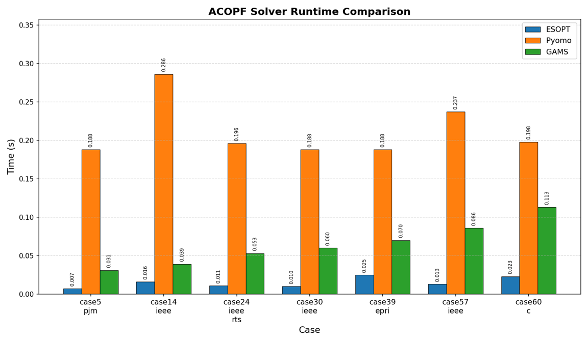

# ESOPT Trial Guide

ESOPT is a high-performance modeling and optimization tool developed in C++. It enables efficient mathematical modeling and solution of engineering problems, with performance surpassing that of other comparable products on the market.



## Installation

1. Extract the archive for your platform to a path containing only ASCII characters.
2. Install TinyCC. On Windows, extract `tcc.zip` to any path containing only ASCII characters, then set the environment variable `LIBTINYCC_DIR=<absolute/path/to/tcc>`. On Linux, clone the source code from `git://repo.or.cz/tinycc.git`, then build and install it.
3. On Windows, compile with the 15.2.0 posix-seh-ucrt-rt_v13 toolchain ([official prebuilt 7z archive](https://github.com/niXman/mingw-builds-binaries/releases/download/15.2.0-rt_v13-rev0/x86_64-15.2.0-release-posix-seh-ucrt-rt_v13-rev0.7z)).

## Academic License Application

ESOPT supports both Linux and Windows. Without a license, models are limited to 300 variables and constraints.

Academic users may apply for one year of free access to the full version. Use the appropriate command below to obtain the host's MAC address, then send it to juyuntao@ncut.edu.cn with your academic license application.

Windows PowerShell:

```powershell
getmac /v
```

Linux:

```bash
ip link show
```

To use the license, set an environment variable that points to the license file on the host.

Linux:

```bash
export LICENSE_LOCATION=/absolute/path/customer.ini
```

Windows PowerShell:

```powershell
$env:LICENSE_LOCATION = 'C:\absolute\path\customer.ini'
```

Contact: juyuntao@ncut.edu.cn
